# PDF Library Processing - Claude AI Integration

## Latest Updates

### Enhanced Citation System Implementation
**Status**: Implemented ✅  
**Files**: `pdf_chat.py`, `pdf_library_processor.py`

#### Citation Features Added:
- **Source Citations**: Every chat response includes book titles and page numbers
- **Real Page References**: Uses actual PDF page numbers (1, 2, 3... to end)
- **Citation Format**: `[Book Title, page X]` at end of sentences
- **Debug Mode**: Full prompt and context displayed after each response
- **Enhanced Metadata**: Complete publishers, DOI/ISBN information in library display

#### Citation Engine Implementation:
```python
# Context format with citations
context_with_citations.append(f"{chunk} [{title}, page {page_ref}]")

# LLM prompt instructions
INSTRUCTIONS:
- Put citations at the END of sentences, not in the middle
- Use format: [Book Title, page X]
- Example: "Balance speed with quality. [Podcasting 100 Success Secrets, page 54]"
```

### Issue #6 - Token-Based Chunking Implementation
**Status**: Implemented ✅  
**Branch**: `feature/token-based-chunking`

#### Changes Made:
- **Replaced character-based chunking** with token-based sliding window
- **Chunk size**: 500 tokens (vs previous 1200 chars)
- **Overlap**: 15% (75 tokens) using sliding window technique
- **Added tiktoken integration** for GPT-4 compatible tokenization
- **Semantic boundary detection** prevents fragmented sentences

#### Benefits:
- **Consistent token counts** across all chunks (exactly 500 tokens)
- **Better RAG performance** with predictable context size
- **Reduced fragmentation** through intelligent sentence boundary detection
- **Sliding window overlap** maintains context continuity

### Performance Analysis - QR Generation Bottleneck
**Status**: Analyzed and documented in Issue #5 ✅

#### Key Findings:
- **Primary bottleneck**: QR frame generation in memvid encoder (80%+ of processing time)
- **Sequential processing**: `/memvid/encoder.py` processes 5,109 chunks one-by-one
- **CPU-intensive**: Each QR code generation + PNG save is computationally expensive
- **Parallelization opportunity**: 8-core CPU could achieve 6-7x speedup (24 min → 4 min)

#### Bottleneck Location:
```python
# File: /memvid/encoder.py (lines 191-219)
def _generate_qr_frames(self, temp_dir: Path, show_progress: bool = True):
    for frame_num, chunk in chunks_iter:  # ← SEQUENTIAL BOTTLENECK
        chunk_data = {"id": frame_num, "text": chunk, "frame": frame_num}
        qr_image = encode_to_qr(json.dumps(chunk_data))  # CPU-intensive
        frame_path = frames_dir / f"frame_{frame_num:06d}.png"
        qr_image.save(frame_path)  # I/O operation
```

#### Recommended Solution:
- **ProcessPoolExecutor** parallelization using all CPU cores
- **Existing infrastructure**: memvid already imports ProcessPoolExecutor
- **Implementation**: Fork memvid package and implement parallel QR generation

## 🎯 Future Architecture Vision

### Complete System Architecture

The eLibrary system is evolving into a comprehensive, secure, and scalable document processing platform with the following architecture:

```mermaid
flowchart TB
    subgraph "📥 Input Layer"
        PDF[📄 PDF Documents]
        CONFIG[⚙️ Configuration Files]
        KEYS[🔑 Encryption Keys]
    end
    
    subgraph "🔄 Processing Pipeline"
        EXTRACT[🔧 PyMuPDF Text Extraction]
        CLEAN[🧹 Text Cleaning & Normalization]
        CHUNK[🔢 Token-Based Chunking]
        META[📊 AI Metadata Extraction]
        ENCRYPT[🔐 AES-256-GCM Encryption]
        QR[📱 QR Code Generation]
        VIDEO[🎥 Video Assembly]
    end
    
    subgraph "☁️ Storage & Distribution"
        S3[🪣 AWS S3 Storage]
        CDN[🌍 CloudFront CDN]
        CACHE[💾 Local Cache]
    end
    
    subgraph "🔒 Security Layer"
        WEB3[🌐 Web3 Key Derivation]
        TOR[🕸️ Tor Hidden Service]
        AUTH[🛡️ Authentication Layer]
    end
    
    subgraph "🌐 Access Interfaces"
        WEBAPP[🌍 Web3 + Tor Application]
        MCP[🤖 MCP Server]
        API[📡 REST API]
        CHAT[💬 Interactive Chat]
    end
    
    subgraph "🛠️ Client Applications"
        CLAUDE[🧠 Claude Desktop Integration]
        VSCODE[📝 VS Code Extension]
        CLI[⌨️ CLI Tools]
        BROWSER[🌐 Anonymous Browser Access]
    end
    
    %% Flow connections
    PDF --> EXTRACT
    EXTRACT --> CLEAN
    CLEAN --> CHUNK
    CHUNK --> META
    META --> ENCRYPT
    ENCRYPT --> QR
    QR --> VIDEO
    
    VIDEO --> S3
    S3 --> CDN
    CDN --> CACHE
    
    KEYS --> WEB3
    WEB3 --> AUTH
    TOR --> WEBAPP
    
    CDN --> WEBAPP
    CDN --> MCP
    CDN --> API
    CDN --> CHAT
    
    MCP --> CLAUDE
    MCP --> VSCODE
    MCP --> CLI
    WEBAPP --> BROWSER
    
    %% Styling
    classDef input fill:#e3f2fd
    classDef process fill:#f3e5f5  
    classDef storage fill:#e8f5e8
    classDef security fill:#fff3e0
    classDef access fill:#fce4ec
    classDef client fill:#f1f8e9
    
    class PDF,CONFIG,KEYS input
    class EXTRACT,CLEAN,CHUNK,META,ENCRYPT,QR,VIDEO process
    class S3,CDN,CACHE storage
    class WEB3,TOR,AUTH security
    class WEBAPP,MCP,API,CHAT access
    class CLAUDE,VSCODE,CLI,BROWSER client
```



## 🚀 Planned Implementation Phases

### Phase 1: Cloud Infrastructure (Issues #11)
**Timeline**: Q1 2025
**Focus**: Scalability and Performance

#### CDN/S3 Streaming Implementation
- **HTTP Range Requests**: Stream video frames on-demand
- **Multi-CDN Support**: AWS S3, CloudFront, generic HTTP servers
- **Authentication**: Bearer tokens, Basic Auth, IAM credentials
- **Performance Target**: 95%+ bandwidth reduction vs full download

```python
# Implementation example
class StreamingMemvidChat:
    def __init__(self, video_url: str, auth_headers: dict = None):
        self.video_url = video_url
        self.auth_headers = auth_headers
        
    def _stream_frame(self, frame_num: int) -> bytes:
        start_byte, end_byte = self._calculate_frame_range(frame_num)
        headers = {**self.auth_headers, 'Range': f'bytes={start_byte}-{end_byte}'}
        response = requests.get(self.video_url, headers=headers)
        return response.content
```

### Phase 2: Security & Encryption (Issue #12)
**Timeline**: Q2 2025
**Focus**: Privacy and Data Protection

#### QR Content Encryption
- **AES-256-GCM**: Military-grade authenticated encryption
- **Zero-Knowledge Architecture**: Server cannot decrypt content
- **Key Management**: PBKDF2 derivation, secure key storage
- **Streaming Compatibility**: Preserves video structure for CDN

```python
# Encryption workflow
def encrypt_chunk(text: str, key: bytes) -> dict:
    aead = AESGCM(key)
    nonce = os.urandom(12)
    ciphertext = aead.encrypt(nonce, text.encode(), None)
    
    return {
        "metadata": {"id": chunk_id, "length": len(text)},  # Public
        "content": {
            "nonce": base64.b64encode(nonce).decode(),
            "data": base64.b64encode(ciphertext).decode()   # Encrypted
        }
    }
```

### Phase 3: Anonymous Access (Issue #13)
**Timeline**: Q3 2025
**Focus**: Privacy and Anonymity

#### Web3 + Tor Integration
- **Tor Hidden Service**: .onion domain for anonymous access
- **Web3 Authentication**: Crypto wallet-based key derivation
- **Client-Side Decryption**: Browser-based cryptography
- **No External Dependencies**: Fully self-contained for Tor

```javascript
// Web3 key derivation in browser
class Web3KeyManager {
    async deriveEncryptionKey(privateKey, libraryId) {
        const combined = `${privateKey}:${libraryId}:memvid`;
        return await crypto.subtle.deriveBits({
            name: 'PBKDF2',
            salt: new TextEncoder().encode('memvid-web3-salt'),
            iterations: 100000,
            hash: 'SHA-256'
        }, keyMaterial, 256);
    }
}
```

### Phase 4: AI Integration (Issue #14)
**Timeline**: Q4 2025
**Focus**: Developer Experience and AI Enhancement

#### MCP Server Implementation
- **Model Context Protocol**: Standard AI assistant integration
- **Technical Documentation**: Code examples, API references
- **IDE Integration**: VS Code, Claude Desktop plugins
- **Real-time Q&A**: Fast development workflow responses

```python
# MCP tool implementation
@mcp_server.tool("search_docs")
async def search_docs(query: str, library: str, top_k: int = 5):
    """Search technical documentation with encrypted content"""
    chat = get_encrypted_library(library)
    results = await chat.search_context(query, top_k=top_k)
    return format_results_with_citations(results)
```

## 🎯 Security Architecture Deep Dive

### Encryption Flow


### Key Management Strategy
1. **Deterministic Derivation**: Keys derived from wallet + library ID
2. **No Server Storage**: Server never stores or sees encryption keys
3. **Perfect Forward Secrecy**: Each library has unique encryption
4. **Key Rotation**: Support for versioned encryption schemes

## 📊 Performance Optimization Roadmap

### Current Bottlenecks Identified
1. **QR Generation**: 80%+ of processing time (sequential)
2. **PDF Extraction**: Can benefit from parallel processing
3. **Metadata Extraction**: Ollama API calls are blocking
4. **Index Building**: Memory-intensive for large libraries

### Optimization Strategies


## 🔧 Development Workflow Integration

### Current Tools Enhancement
- **pdf_chat.py**: Enhanced with streaming and encryption
- **pdf_library_processor.py**: Parallel processing and QR optimization
- **GitHub Actions**: Automated testing and deployment
- **Documentation**: Real-time updates with implementation progress

### Future Tool Additions
- **memvid_mcp_server.py**: MCP protocol implementation
- **web3_tor_app.py**: Anonymous web application
- **streaming_client.py**: CDN-enabled client library
- **encryption_tools.py**: Key management utilities

This architecture represents a complete evolution from a simple PDF processor to an enterprise-grade, privacy-focused, scalable document intelligence platform.

## Issue #2 Resolution - PyMuPDF Implementation

### Problem Solved
**Issue #2**: PDF text extraction had encoding errors affecting RAG quality:
- "Gener ative AI" instead of "Generative AI" 
- "wri\^@en" instead of "written"
- "P ackt" instead of "Packt"
- Null bytes and Unicode issues

### Solution Implemented
**Replaced PyPDF2 with PyMuPDF** in `pdf_library_processor.py` for superior text extraction quality.

## PyMuPDF Integration Details

### Key Changes Made

#### 1. Library Replacement
```python
# OLD: import PyPDF2
# NEW: 
import pymupdf as fitz
```

#### 2. Enhanced Text Extraction Method
```python
def extract_text_with_pages(self, pdf_path: Path) -> Tuple[Dict[int, str], int]:
    """Extract text from PDF with page-by-page mapping using PyMuPDF."""
    try:
        # Open PDF with PyMuPDF
        doc = fitz.open(pdf_path)
        num_pages = len(doc)
        page_texts = {}
        
        for page_num in range(num_pages):
            page = doc[page_num]
            # Extract text from page
            page_text = page.get_text()
            # Clean the extracted text to fix Issue #2 problems
            cleaned_text = self.clean_extracted_text(page_text)
            page_texts[page_num + 1] = cleaned_text  # 1-based page numbering
            
        doc.close()
        return page_texts, num_pages
    except Exception as e:
        print(f"Error reading PDF {pdf_path}: {e}")
        return {}, 0
```

#### 3. Text Cleaning Function Added
```python
def clean_extracted_text(self, text: str) -> str:
    """Clean extracted PDF text from encoding issues."""
    if not text:
        return ""
    
    # Remove null bytes and other control characters
    text = re.sub(r'[\x00-\x08\x0b\x0c\x0e-\x1f\x7f-\x84\x86-\x9f]', '', text)
    
    # Fix multiple spaces while preserving intentional formatting
    text = re.sub(r'[ \t]+', ' ', text)  # Multiple spaces/tabs to single space
    text = re.sub(r'[ \t]*\n[ \t]*', '\n', text)  # Clean line breaks
    text = re.sub(r'\n{3,}', '\n\n', text)  # Limit multiple newlines
    
    # Fix common PDF extraction issues like split words
    text = re.sub(r'([a-z])(\s+)([A-Z])', r'\1 \3', text)
    
    # Remove Unicode replacement characters
    text = text.replace('\ufffd', '')
    
    return text.strip()
```

## Performance Analysis Results

### Comprehensive Testing Results
**Tested 3 methods on 7 PDFs:**

| Method | Total Issues | Issue #2 Problems | Quality Score | Speed |
|--------|-------------|------------------|---------------|-------|
| PyPDF2 | 23,925 | **17** ❌ | 993.9/1000 | Fast |
| **PyMuPDF** | **7,757** | **0** ✅ | **995.4/1000** | **Fastest** |
| Docling | 8,487 | 0 ✅ | 996.0/1000 | Slow (30min timeout) |

### Why PyMuPDF Was Chosen

1. **✅ Eliminates Issue #2 completely** (0 encoding problems vs 17 in PyPDF2)
2. **✅ Fastest extraction speed** - No AI model loading like Docling
3. **✅ Lowest total issues** (7,757 vs 23,925 in PyPDF2)
4. **✅ High quality score** (995.4/1000)
5. **✅ Native PDF handling** - Better than PyPDF2's parser
6. **✅ Simple integration** - Drop-in replacement

## Testing Commands

### Test implementation
```bash
source venv/bin/activate
python3 pdf_library_processor.py
```

### Verify processing quality
```bash
# Check output quality in generated files
ls -la memvid_out/
```

## Updated Dependencies

### requirements.txt
```txt
memvid
pymupdf  # Replaced PyPDF2
requests
tqdm
```

### Installation
```bash
pip install pymupdf
```

## Verification Steps

1. **Import Test**: `python3 -c "import pdf_library_processor; print('✅ Import successful')"`
2. **Run Processing**: `python3 pdf_library_processor.py`
3. **Check Output Quality**: Compare generated `library_index.json` for encoding issues
4. **Search Test**: Use `pdf_chat.py` to verify improved search results

## Expected Improvements

After PyMuPDF implementation:
- **No more "Gener ative AI" split words**
- **No more null bytes (\^@) in extracted text**
- **No more "P ackt" publisher name issues**
- **Cleaner text for better RAG search accuracy**
- **Faster processing compared to Docling**
- **Better context preservation in chunks**

## Monitoring

To verify Issue #2 is fixed, check for these patterns in output:
```python
# Should be 0 after fix:
text.count('Gener ative')  # Should be "Generative" 
text.count('wri\^@en')     # Should be "written"
text.count('P ackt')       # Should be "Packt"
```

## Notes for Future Development

- PyMuPDF provides excellent text quality without AI overhead
- Text cleaning function can be enhanced for specific domain issues
- Consider adding OCR capabilities for scanned PDFs if needed
- Monitor extraction quality with periodic testing

---

## Session Summary: December 15, 2024

This session completed comprehensive improvements to the MemVid document processing pipeline:

### Major Achievements

#### 1. **Warning Suppression System** ✅
- **Problem**: Persistent warnings from MemVid, TensorFlow, and tokenizer libraries
- **Solution**: Multi-layered suppression (environment variables, import-time context managers, worker-level suppression)
- **Result**: Clean, professional application experience

#### 2. **Enhanced Progress Tracking** ✅
- **Problem**: Progress bars disappeared during warning suppression
- **Solution**: Selective progress restoration with clean output
- **Features**: PDF-level progress, step-by-step processing feedback, preserved tqdm bars

#### 3. **Smart Skip Mechanism** ✅
- **Problem**: Slow development iterations due to reprocessing 
- **Solution**: Index-based skip detection with `--force-reprocess` override
- **Result**: Significant speed improvement for testing

#### 4. **Parallel Processing Investigation** ✅
- **Problem**: Single-core QR generation despite `--max-workers 8`
- **Analysis**: Root cause identified in MemvidEncoder API
- **Solution**: Monkey patching with ProcessPoolExecutor for parallel QR generation

#### 5. **Citation System Enhancement** ✅
- **Problem**: Missing citations and page number mismatches
- **Solution**: Enhanced citation system with book titles and accurate page references
- **Features**: Smart page detection, enhanced metadata, debug mode

#### 6. **Quality of Life Improvements** ✅
- Multiple execution wrappers (`pdf_processor_quiet.py`, `pdf_process_clean.sh`)
- Enhanced error handling and QR version overflow protection
- Improved developer experience with detailed feedback

### Files Modified/Created

**Core Processing Files:**
- `pdf_library_processor.py` - Main processor with all enhancements
- `pdf_chat.py` - Enhanced citation system
- `pdf_processor_quiet.py` - Clean output wrapper
- `pdf_process_clean.sh` - Shell script wrapper
- `test_progress.py` - Progress tracking test

**Documentation:**
- `CLAUDE.md` - Comprehensive development notes
- `README.md` - Enhanced with future architecture
- Various test files for validation

### Technical Implementation Highlights

**Warning Suppression Pattern:**
```python
# Comprehensive suppression before imports
warnings.filterwarnings("ignore")
os.environ['TF_CPP_MIN_LOG_LEVEL'] = '3'
os.environ['TOKENIZERS_PARALLELISM'] = 'false'

# Import-time suppression
with suppress_stdout(), suppress_stderr(), warnings.catch_warnings():
    warnings.simplefilter("ignore")
    from memvid import MemvidEncoder
```

**Progress Tracking System:**
```python
# PDF-level progress with skip detection
for i, pdf_path in enumerate(pdf_files, 1):
    print(f"\n[{i}/{len(pdf_files)}] Processing: {pdf_path.name}")
    if pdf_path.name in self.processed_pdfs:
        print(f"  ✅ Skipped (already processed)")
```

**Parallel QR Generation:**
```python
# Monkey patching for ProcessPoolExecutor parallelization
def monkey_patch_parallel_qr_generation(encoder, n_workers: int):
    with ProcessPoolExecutor(max_workers=n_workers) as executor:
        results = list(tqdm(executor.map(generate_single_qr_global, chunk_tasks)))
```

### Results Achieved
- ✅ Clean application output without warnings
- ✅ Fast development iterations with smart skip
- ✅ Accurate citations with proper page references  
- ✅ Parallel processing capability (8 workers for QR generation)
- ✅ Professional user experience with detailed progress tracking
- ✅ Comprehensive documentation for future development

### Next Steps Identified
1. Document all changes and push to remote main ← **CURRENT TASK**
2. Clean up feature branches once merged
3. Consider implementing proper MemvidEncoder API usage
4. Continue with architecture roadmap (CDN streaming, encryption, Web3+Tor)

This session transformed the system from a functional prototype into a production-ready document processing pipeline with enterprise-grade user experience.