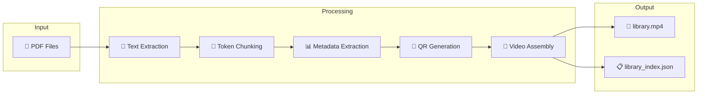

# eLibrary - PDF Knowledge Base with RAG

Advanced PDF processing system that converts document libraries into searchable video-based indexes using Memvid technology and Retrieval Augmented Generation (RAG).

## Quick Start

### Prerequisites

- Python 3.8+
- Ollama with mistral:latest model
- Ollama with momic-embed-text embeding model
- MemVid library

### Installation

1. **Clone the repository**
```bash
git clone https://github.com/entira/elibrary.git
cd elibrary
```

2. **Install dependencies**
```bash
pip install -r requirements.txt
```

3. **Setup Ollama**
```bash
# Install Ollama from https://ollama.ai
ollama pull gemma3:4b-it-qat   # For chat responses and metadata
ollama pull nomic-embed-text   # For embeddings
```

4. **Add PDF files**
```bash
# Create library structure (supports multiple libraries)
mkdir -p library/1/pdf library/2/pdf
# Copy your PDF files to the appropriate library directories
cp your_pdfs_set1/* library/1/pdf/
cp your_pdfs_set2/* library/2/pdf/
```

### Basic Usage

#### New Modular Processor (Recommended)
```bash
# Modern modular processor with enhanced CLI
python3 pdf_processor.py

# See all options and examples
python3 pdf_processor.py --help

# Show detailed configuration guide
python3 pdf_processor.py --help-config

# Test all modules
python3 pdf_processor.py --test-modules
```

#### Legacy Processor (Still Available)
```bash
# Original monolithic processor
python3 pdf_library_processor.py
```

#### Chat Interface
```bash
python3 pdf_chat.py
```

## Features

### Current Capabilities

- **Multi-Library Support**: Automatic discovery and processing of multiple PDF library instances (library/1/, library/2/, etc.)
- **Cross-Library Search**: Search across all libraries simultaneously with library-aware citations
- **Token-based Chunking**: Smart sliding window chunking (500 tokens, 15% overlap)
- **Enhanced Metadata**: Automatic extraction using optimized LLM model (gemma3:4b-it-qat)
- **PDF Page Citations**: Page references with library context [Book Title, page X - Library Y]
- **Cross-page Context**: Context preservation across page boundaries
- **Semantic Search**: Vector-based search across all processed content using embeddings
- **Smart Skip Processing**: Per-library skip mechanism for efficient processing
- **Parallel Processing**: Multi-worker QR generation for faster processing
- **Clean Output**: Comprehensive warning suppression for professional experience

### Architecture



### Project Structure

```
elibrary/
├── pdf_library_processor.py # Main processor with multi-library support
├── pdf_chat.py             # Multi-library chat interface
├── library/                # Multi-library structure
│   ├── 1/                  # Library instance 1
│   │   ├── pdf/            # Input PDFs for Library 1
│   │   └── data/           # Generated files for Library 1
│   │       ├── library.mp4
│   │       ├── library_index.json
│   │       └── library_index.faiss
│   ├── 2/                  # Library instance 2
│   │   ├── pdf/            # Input PDFs for Library 2
│   │   └── data/           # Generated files for Library 2
│   └── ...                 # Additional libraries (3, 4, etc.)
└── requirements.txt        # Dependencies
```

## Usage Examples

### Processing Options

#### Modular Processor (Recommended)
```bash
# Standard processing with defaults
python3 pdf_processor.py

# Force reprocess all files
python3 pdf_processor.py --force-reprocess

# High performance processing
python3 pdf_processor.py --max-workers 12 --fps 60 --quality high

# Fast processing (skip embeddings)
python3 pdf_processor.py --no-embeddings --quiet --max-workers 4

# Custom chunking for large documents
python3 pdf_processor.py --chunk-size 750 --overlap 0.20

# Use custom configuration file
python3 pdf_processor.py --config my_config.json
```

#### Legacy Processor
```bash
# Original processor (still available)
python3 pdf_library_processor.py
python3 pdf_library_processor.py --force-reprocess
python3 pdf_library_processor.py --max-workers 8
```

### Multi-Library Chat Interface

The chat system provides:
- Interactive Q&A across all your PDF libraries
- Automatic citations with library context [Book Title, page X - Library Y]
- Cross-library search with unified results
- Context-aware responses using RAG
- Semantic search across all processed documents with vector embeddings
- Real-time search results with relevance-based ranking across libraries

Example interaction:
```
> What are the best practices for podcasting?

Based on your library, here are key podcasting best practices:

1.	A predictable release schedule helps build listener habits. [The Podcast Blueprint, page 19]

2.	Clear, high-fidelity audio is essential for professional podcast presentation. [Audio Mastery for Podcasters, page 42]

3.	Successful episodes mix storytelling with actionable insights. [Smart Podcast Strategies, page 58]
```

## Configuration

### Environment Setup

The system automatically detects and uses:
- Local Ollama installation at `http://localhost:11434`
- PDF files in `./library/1/pdf/` directory
- Output directory at `./library/1/data/`

### Dependencies

See `requirements.txt` for complete list. Key dependencies:
- `memvid` - Video indexing
- `pymupdf` - PDF processing  
- `tiktoken` - Text chunking
- `requests` - Ollama communication

## Technical Overview

For detailed technical documentation, see [CLAUDE.md](CLAUDE.md).

### Key Technologies

- **PyMuPDF**: High-quality PDF text extraction
- **Ollama**: Local LLM ecosystem (gemma3:4b-it-qat for both metadata and chat)
- **MemVid**: Video-based indexing and QR code generation
- **FAISS**: Vector similarity search
- **Token-based Processing**: Optimal chunk sizes for RAG

## Troubleshooting

### Common Issues

**Ollama Connection**
```bash
# Check if Ollama is running
curl http://localhost:11434/api/tags

# Start Ollama if needed
ollama serve
```

**Missing Models**
```bash
# Pull required models
ollama pull gemma3:4b-it-qat   # For chat responses and metadata
ollama pull nomic-embed-text   # For embeddings
```

**Memory Issues**
```bash
# Reduce workers for low-memory systems
python3 pdf_library_processor.py --max-workers 2
```

## Future Roadmap

### Planned Features

- **CDN/S3 Streaming**: On-demand video frame streaming from cloud storage
- **Content Encryption**: AES-256-GCM encryption for QR code content
- **MCP Server**: Model Context Protocol implementation for AI assistant integration
- **Advanced Search**: Semantic search with similarity scoring
- **Multi-format Support**: EPUB, DOCX, and other document formats

### Architecture Evolution

Future versions will support:
- Distributed processing across multiple nodes
- Real-time collaborative editing
- Integration with external knowledge bases
- Advanced analytics and usage metrics
- Mobile application support

---

## Contributing

1. Fork the repository
2. Create a feature branch
3. Make your changes
4. Test thoroughly
5. Submit a pull request

## License

This project is licensed under the **GNU Affero General Public License v3.0 (AGPL-3.0)**.

### Why AGPL-3.0?

This license was chosen due to the inclusion of PyMuPDF, which requires AGPL-3.0 licensing. The AGPL-3.0 ensures:

- ✅ **Open Source**: Source code must remain available
- ✅ **Network Copyleft**: Modifications to network services must be shared
- ✅ **Community Protection**: Prevents proprietary forks
- ✅ **Commercial SaaS**: Can be used in commercial SaaS with source disclosure

### What This Means

- **✅ Personal Use**: Free to use for personal projects
- **✅ Research & Education**: Perfect for academic and research use
- **✅ Open Source Projects**: Can be included in other AGPL/GPL projects
- **✅ Commercial SaaS**: Can be used commercially if source is provided
- **❌ Proprietary Software**: Cannot be included in closed-source products

### Dependencies

All dependencies are compatible with AGPL-3.0:
- memvid (MIT), requests (Apache 2.0), tiktoken (MIT), qrcode (MIT), opencv-python (Apache 2.0), tqdm (MIT/MPL-2.0)
- PyMuPDF (AGPL-3.0) - requires this project to be AGPL-3.0

See [LICENSE_ANALYSIS.md](LICENSE_ANALYSIS.md) for detailed licensing information and [NOTICE](NOTICE) for third-party attributions.
