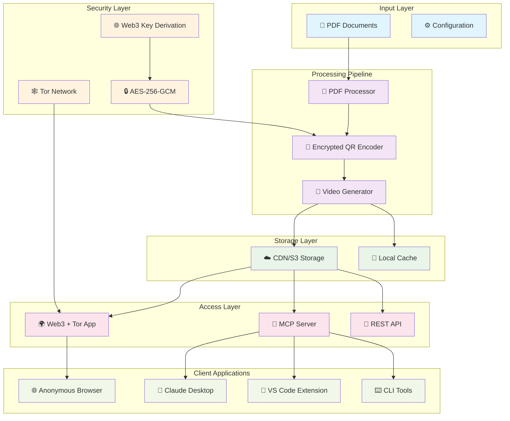
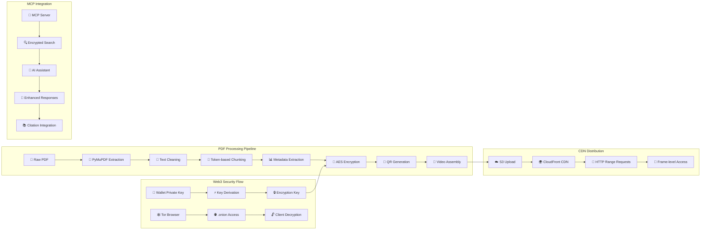
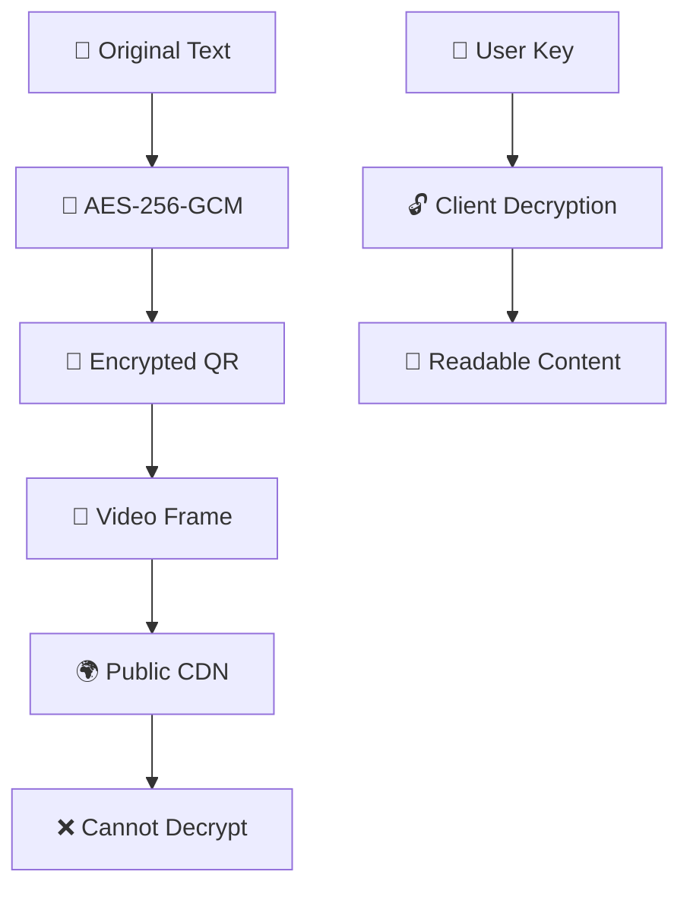
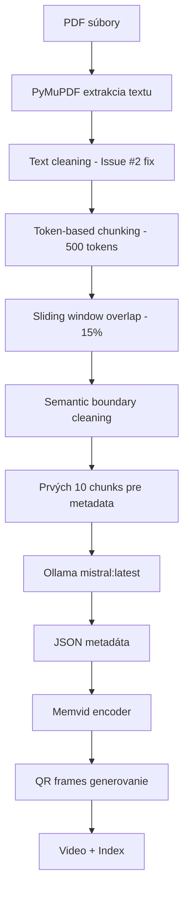

# eLibrary - PDF Knowledge Base with RAG

Advanced PDF processing system that converts document libraries into searchable video-based indexes using Memvid technology and Retrieval Augmented Generation (RAG).

## 🏗️ System Architecture

### Current Implementation
Advanced processing pipeline with enhanced metadata extraction and cross-page context preservation:

- **Current Processor**: Token-based sliding window chunking (500 tokens, 15% overlap) with detailed page metadata

### Future Architecture Overview



### Detailed Component Architecture



## 🎯 Current Features

- **High-Quality PDF Processing**: PyMuPDF-based extraction that eliminates encoding issues
- **Token-Based Chunking**: 500-token sliding window chunks with 15% overlap for optimal RAG performance
- **Semantic Boundary Preservation**: Intelligent sentence boundary detection prevents fragmented chunks
- **Issue #2 Resolution**: Fixes "Gener ative AI", null bytes, and split word problems
- **AI Metadata Extraction**: Ollama-powered extraction of titles, authors, publishers, years, DOI/ISBN
- **Video-based Indexing**: QR-encoded text chunks in video frames for efficient storage
- **Cross-page Context**: Enhanced processor preserves context between pages
- **RAG Integration**: Ready for Retrieval Augmented Generation workflows
- **Interactive Chat**: Query your PDF library with natural language and source citations
- **Accurate Page References**: Real PDF page numbers for precise citation tracking
- **Enhanced Library Display**: Complete metadata including publishers, DOI/ISBN information

## 🚀 Planned Features & Roadmap

### 📍 Phase 1: Cloud Infrastructure (Q1 2025)

#### CDN/S3 Streaming Support ([Issue #11](https://github.com/entira/elibrary/issues/11))
- **HTTP Range Requests**: Stream video frames on-demand from CDN
- **Multi-CDN Support**: AWS S3/CloudFront, generic HTTP servers
- **Authentication**: Bearer tokens, Basic Auth, IAM credentials
- **Performance**: 95%+ bandwidth reduction vs full video download
- **Scalability**: Unlimited concurrent users with shared CDN storage

**Implementation:**
```python
# Stream-enabled chat interface
chat = StreamingMemvidChat(
    video_url="https://cdn.example.com/library.mp4",
    index_url="https://cdn.example.com/library_index.json",
    auth_headers={"Authorization": "Bearer token"}
)
```

### 🔒 Phase 2: Security & Encryption (Q2 2025)

#### QR Code Content Encryption ([Issue #12](https://github.com/entira/elibrary/issues/12))
- **AES-256-GCM Encryption**: Military-grade encryption for sensitive content
- **Zero-Knowledge Server**: Server cannot decrypt user content
- **Public Metadata**: Keep indexing fast while content stays encrypted
- **Key Management**: PBKDF2 key derivation, environment-based keys
- **Streaming Compatible**: Video structure preserved for CDN delivery

**Security Model:**


### 🕸️ Phase 3: Anonymous Access (Q3 2025)

#### Web3 + Tor Application ([Issue #13](https://github.com/entira/elibrary/issues/13))
- **Tor Hidden Service**: Anonymous .onion domain access
- **Web3 Authentication**: Crypto wallet-based key derivation
- **Client-Side Decryption**: Browser-based cryptography (Web Crypto API)
- **No External Dependencies**: Fully self-contained for Tor compatibility
- **Privacy-First Design**: Zero tracking, no cookies, no analytics

**Web3 Integration:**
```javascript
// Browser-based key derivation
class Web3KeyManager {
    async deriveEncryptionKey(privateKey, libraryId) {
        const combined = `${privateKey}:${libraryId}:memvid`;
        // PBKDF2 key derivation in browser
        return await crypto.subtle.deriveBits({
            name: 'PBKDF2',
            salt: encoder.encode('memvid-web3-salt'),
            iterations: 100000,
            hash: 'SHA-256'
        }, keyMaterial, 256);
    }
}
```

### 🤖 Phase 4: AI Integration (Q4 2025)

#### MCP Server for Documentation Q&A ([Issue #14](https://github.com/entira/elibrary/issues/14))
- **Model Context Protocol**: Standard integration with Claude and other AI assistants
- **Technical Documentation Focus**: Code examples, API references, tutorials
- **IDE Integration**: VS Code extensions, Claude Desktop plugins
- **Real-time Q&A**: Fast responses for development workflows
- **Enhanced Citations**: Precise source references with line numbers

**MCP Tools:**
```python
# MCP tool examples
@mcp_server.tool("search_docs")
async def search_docs(query: str, library: str, top_k: int = 5):
    """Search technical documentation with encrypted content"""
    
@mcp_server.tool("answer_question") 
async def answer_question(question: str, library: str):
    """Answer questions using encrypted docs with citations"""
    
@mcp_server.tool("explain_code")
async def explain_code(code_snippet: str, language: str):
    """Explain code using relevant documentation"""
```

## 🎯 Use Case Evolution

### Current: Basic PDF Q&A
```bash
# Simple local chat
python3 pdf_chat.py
🤔 You: How to make better podcasts?
🤖 Answer with citations...
```

### Phase 1: Scalable Cloud Deployment
```bash
# Multi-user cloud-based system
chat = StreamingMemvidChat("https://cdn.company.com/docs.mp4")
# Serves unlimited users from shared CDN
```

### Phase 2: Secure Enterprise
```bash
# Encrypted content for sensitive documents
chat = EncryptedMemvidChat(video_url, encryption_key)
# Zero-knowledge: server never sees decrypted content
```

### Phase 3: Anonymous Research
```bash
# Privacy-focused research via Tor
# Access via: abc123def456.onion
# Web3 wallet authentication
# Fully anonymous document analysis
```

### Phase 4: AI-Augmented Development
```bash
# VS Code integration
# Hover over function → instant documentation
# Claude Desktop enhanced with domain knowledge
# Real-time code explanations with citations
```

## 📊 Performance & Security Matrix

| Feature | Scalability | Security | Privacy | Performance |
|---------|-------------|----------|---------|-------------|
| **Current Local** | ⭐ | ⭐⭐ | ⭐⭐⭐ | ⭐⭐⭐⭐ |
| **CDN Streaming** | ⭐⭐⭐⭐⭐ | ⭐⭐ | ⭐⭐ | ⭐⭐⭐⭐⭐ |
| **QR Encryption** | ⭐⭐⭐⭐ | ⭐⭐⭐⭐⭐ | ⭐⭐⭐⭐ | ⭐⭐⭐⭐ |
| **Web3 + Tor** | ⭐⭐⭐ | ⭐⭐⭐⭐⭐ | ⭐⭐⭐⭐⭐ | ⭐⭐⭐ |
| **MCP Integration** | ⭐⭐⭐⭐ | ⭐⭐⭐⭐ | ⭐⭐⭐ | ⭐⭐⭐⭐⭐ |

## 🔗 Integration Ecosystem

### Development Tools
- **VS Code Extension**: Inline documentation, hover help
- **Claude Desktop**: Enhanced AI responses with domain knowledge
- **CLI Tools**: Command-line documentation search
- **API Gateway**: REST endpoints for custom integrations

### Enterprise Features
- **Multi-tenancy**: Isolated libraries per organization
- **Access Control**: Role-based permissions, audit logs
- **Analytics**: Usage tracking, search analytics
- **Compliance**: GDPR-ready, SOC2 compatible

### Research Applications
- **Academic Papers**: Encrypted research document analysis
- **Legal Documents**: Confidential case law research
- **Medical Records**: HIPAA-compliant document Q&A
- **Financial Reports**: Sensitive financial analysis

## 📋 Požiadavky

### Systémové požiadavky
- Python >= 3.10
- Ollama server bežiaci na `localhost:11434`
- Modely v Ollama: `mistral:latest` a `nomic-embed-text`

### Python závislosti
```bash
pip install -r requirements.txt
```

```txt
memvid
pymupdf
requests
tqdm
tiktoken
```

## 🏗️ Architektúra

### Core Components

#### 1. **OllamaEmbedder**
- **Purpose**: Generate embeddings using `nomic-embed-text` model
- **Endpoint**: `POST http://localhost:11434/api/generate`
- **Parameters**: `{"model": "nomic-embed-text", "embedding": true}`

#### 2. **PDFLibraryProcessor**
- **Basic processing** with standard chunking
- **Configuration**:
  - Input folder: `./pdf_books`
  - Output folder: `./memvid_out`
  - Chunk size: 512 characters, Overlap: 50 characters
  - Output: 8,975 segments, ~482 chars average

#### 3. **PDFLibraryProcessor (Enhanced with Token-Based Chunking)**
- **Advanced processing** with high-quality text extraction and intelligent chunking
- **PyMuPDF Integration**: Eliminates encoding issues that caused Issue #2 problems
- **Token-Based Sliding Window**: Consistent 500-token chunks with 15% overlap
- **Configuration**:
  - Input folder: `./pdf_books`
  - Output folder: `./memvid_out`
  - Chunk size: 500 tokens (~2000 characters)
  - Overlap: 75 tokens (15%)
  - Method: Sliding window with semantic boundary detection
  - Features: Cross-page chunks, detailed page references, automatic text cleaning

### Workflow



## 🔧 Funkcionalita

### 1. Extrakcia metadát pomocou AI

```python
def extract_metadata_with_ollama(self, sample_text: str) -> Dict[str, str]:
```

**Proces**:
1. Vezme prvých 10 chunks z PDF
2. Spojí ich do sample_text 
3. Pošle prompt do `mistral:latest`:
   ```
   Extract JSON with keys: title, authors, publishers, year, doi from this text:
   [sample_text]
   Return only valid JSON.
   ```
4. Parsuje JSON odpoveď
5. Validuje a normalizuje dáta

**Výstup**:
```json
{
  "title": "RAG-Driven Generative AI",
  "authors": "Denis Rothman",
  "publishers": "Packt Publishing", 
  "year": "2024",
  "doi": "10.1234/example"
}
```

### 2. PDF Processing Pipeline

```python
def process_pdf(self, pdf_path: Path) -> bool:
```

**Kroky**:
1. **Extrakcia textu** pomocou PyPDF2
2. **Chunking** na ~100 slov per chunk
3. **Metadata extraction** z prvých 10 chunks
4. **Pridanie do memvid** encoder

### 3. Video Index Generation

```python
encoder.add_pdf(str(pdf_path), chunk_size=512, overlap=50)
encoder.build_video("library.mp4", "library_index.json")
```

**Vytvorí**:
- 🎥 **library.mp4**: Video kde každý frame obsahuje QR kód s chunks
- 📋 **library_index.json**: Metadata a mappings
- 🔍 **library_index.faiss**: Vector search index

## 📁 Project Structure

```
eLibrary/
├── pdf_library_processor.py      # Enhanced PDF processor with page metadata
├── pdf_library_chat.py           # Interactive chat interface
├── requirements.txt              # Python dependencies
├── README.md                     # This documentation
├── .gitignore                    # Git ignore rules
├── .github/                      # 🤖 GitHub Actions automation
│   ├── workflows/
│   │   └── auto-fix-issues.yml   # Automated issue fixing workflow
│   ├── actions/
│   │   └── claude-ai-fix/        # Custom AI fix action
│   ├── ISSUE_TEMPLATE/           # Structured issue templates
│   │   ├── auto-fix-bug.md       # Bug report template
│   │   └── auto-fix-enhancement.md # Enhancement template
│   ├── README.md                 # GitHub Actions documentation
│   ├── SETUP_INSTRUCTIONS.md     # Setup guide
│   └── test_auto_fix.py          # Test script
├── pdf_books/                    # Input PDF files (excluded from git)
│   ├── book1.pdf
│   └── book2.pdf
├── memvid_out/                   # Output (excluded from git)
│   ├── library.mp4              # Video index
│   ├── library_index.json       # Enhanced metadata
│   └── library_index.faiss      # Vector index
└── venv/                        # Python virtual environment (excluded)
```

## 🚀 Použitie

### 1. Príprava prostredia

```bash
# Vytvorenie virtual environment
python3 -m venv venv
source venv/bin/activate

# Inštalácia závislostí
pip install -r requirements.txt
```

### 2. Spustenie Ollama

```bash
# Stiahnutie modelov
ollama pull mistral:latest
ollama pull nomic-embed-text

# Overenie že Ollama beží
curl http://localhost:11434/api/tags
```

### 3. Pridanie PDF súborov

```bash
# Vytvorenie priečinka a pridanie PDF
mkdir -p pdf_books
cp *.pdf pdf_books/
```

### 4. Run Processing

**Main Processor**
```bash
python3 pdf_library_processor.py
```

```bash
python3 pdf_library_processor.py
```

**Benefits:**
- 61% more text segments (14,486 vs 8,975)
- Shorter, more precise chunks (362 vs 482 chars)
- Cross-page context preservation (2,184 cross-page chunks)
- Detailed page metadata for each chunk
- Enhanced statistics and book information

### 5. Chat s knižnicou

Po vytvorení video indexu môžete spustiť chat interface:

```bash
python3 pdf_library_chat.py
```

## 📊 Processing Results

### Enhanced Output
```
Found 7 PDF files to process
Output directory: memvid_out_v2
Chunk size: 400 chars, Overlap: 50 chars

Processing: RAG-Driven Generative AI...
  - Pages: 517, Enhanced chunks: 2316
  - Extracting metadata...
  - Title: RAG-Driven Generative AI
  - Authors: Denis Rothman
  - Year: 2024

Generating QR frames: 100%|██████| 14486/14486 [24:09<00:00]
Enhancing index with detailed metadata...

✅ SUCCESS!
📚 Processed 7 PDF books
🎥 Enhanced video: memvid_out/library.mp4
📋 Enhanced index: memvid_out/library_index.json
📄 Each chunk includes detailed page references!
```

### Performance Comparison

| Metric | Previous | Current | Improvement |
|--------|----------|-------------|-------------|
| Total segments | 8,975 | 14,486 | +61% |
| Avg segment length | 482 chars | 362 chars | -25% (more precise) |
| Cross-page chunks | 0 | 2,184 | New feature |
| Page metadata | Basic | Detailed | Enhanced |
| Unique pages indexed | N/A | 2,245 | New feature |

### Vytvorené súbory

#### `library.mp4`
- Video kde každý frame = 1 chunk ako QR kód
- Framerate: 1 FPS (default memvid)
- Formát: MP4 s H.264 codec

#### `library_index.json` (Enhanced)
```json
{
  "metadata": [
    {
      "id": 0,
      "text": "RAG-Driven Generative AI\nBuild custom retrieval...",
      "frame": 0,
      "length": 134
    }
  ],
  "enhanced_stats": {
    "total_files": 7,
    "total_chunks": 14486,
    "total_unique_pages": 2245,
    "cross_page_chunks": 2184,
    "files": {
      "RAG-Driven Generative AI...pdf": {
        "chunks": 2316,
        "unique_pages": 517,
        "title": "RAG-Driven Generative AI",
        "authors": "Denis Rothman",
        "year": "2024"
      }
    }
  }
}
```

#### `library_index.faiss`
- Binárny FAISS vector index
- 384-dimenzionálne embeddings (nomic-embed-text)
- Umožňuje semantické vyhľadávanie

## 🔍 Interné detaily

### Chunk Storage Lifecycle

1. **V pamäti**: `encoder.chunks[]` - list všetkých chunks
2. **Dočasne**: `/tmp/tmp*/frames/frame_*.png` - QR obrázky
3. **Finálne**: `library.mp4` + index súbory

### Error Handling

```python
# PDF parsing errors
except Exception as e:
    print(f"Error reading PDF {pdf_path}: {e}")
    return [], 0

# Ollama API errors  
except Exception as e:
    print(f"Error extracting metadata with Ollama: {e}")
    return self._empty_metadata()
```

### Performance

- **Chunk generovanie**: ~10 chunks/sec
- **QR frame generovanie**: ~10-15 frames/sec  
- **Metadata extrakcia**: ~5-10 sec per PDF
- **Celkový čas**: ~2-3 min pre 7 PDF (varies by size)

## 🎛️ Konfigurácia

### Memvid parametre
```python
# V PDFLibraryProcessor.__init__()
self.encoder = MemvidEncoder()

# V process_pdf()
self.encoder.add_pdf(str(pdf_path), chunk_size=512, overlap=50)
```

### Ollama endpointy
```python
# Embeddings
POST http://localhost:11434/api/generate
{
  "model": "nomic-embed-text",
  "prompt": text,
  "embedding": true
}

# Metadata extraction
POST http://localhost:11434/api/generate  
{
  "model": "mistral:latest",
  "prompt": "Extract JSON...",
  "options": {"temperature": 0.1}
}
```

## ⚠️ Známe limitácie

1. **PDF parsing**: Niektoré PDF môžu mať problémy s text extraction
2. **Ollama dostupnosť**: Vyžaduje bežiaci Ollama server
3. **Memory usage**: Veľké PDF môžu spotrebovať veľa RAM
4. **Processing time**: Video generovanie je časovo náročné
5. **Metadata quality**: Závisí od kvality text extraction a AI modelu

## 🔧 Troubleshooting

### Ollama connection failed
```bash
# Skontrolovať či Ollama beží
ollama list
curl http://localhost:11434/api/tags
```

### PDF extraction errors
```python
# Skontrolovať PyPDF2 log v konzole
# Niektoré PDF môžu byť chránené/poškodené
```

### Memory errors
```bash
# Spracovávať PDF po menších dávkach
# Alebo zvýšiť system memory/swap
```

## 🤖 GitHub Actions Automatizácia

✅ **Kompletne implementovaný automatizovaný systém na riešenie issues!**

### 🎯 Ako používať:

#### 1. **Vytvorte issue s template:**
```
GitHub → Issues → New issue → Choose template:
- 🤖 Auto-Fix Bug Report
- 🚀 Auto-Fix Enhancement
```

#### 2. **Aktivujte automatizáciu:**
```bash
# Pridajte label na issue
gh issue edit ISSUE_NUMBER --add-label "auto-fix"

# Alebo cez web interface v GitHub
```

#### 3. **Sledujte progress:**
```bash
# GitHub Actions workflow sa automaticky spustí
https://github.com/entira/elibrary/actions

# AI vytvorí PR s riešením
gh pr list --label "auto-fix"
```

### 🛠️ Implementované komponenty:
- ✅ **GitHub Actions workflow** (`.github/workflows/auto-fix-issues.yml`)
- ✅ **Issue templates** s štruktúrovaným formulárom
- ✅ **Custom AI action** pre automated fixes
- ✅ **Automated testing** a validation
- ✅ **Smart labeling system**

### 📋 Ako to funguje:
1. **Issue detection** - workflow reaguje na label `auto-fix`
2. **AI analysis** - analyzuje problém a kód context
3. **Fix generation** - vytvorí riešenie based on issue description
4. **Automated testing** - validuje syntax a imports
5. **PR creation** - vytvorí pull request s fix
6. **Manual review** - vyžaduje human approval pred merge

### 📚 Dokumentácia:
- **Setup guide**: [`.github/SETUP_INSTRUCTIONS.md`](.github/SETUP_INSTRUCTIONS.md)
- **System overview**: [`.github/README.md`](.github/README.md)
- **Test script**: [`.github/test_auto_fix.py`](.github/test_auto_fix.py)

## 📈 Rozšírenia

### Možné vylepšenia
1. **Batch processing**: Spracovanie po dávkach pre veľké kolekcie
2. **Multi-threading**: Paralelné spracovanie PDF
3. **Database storage**: Ukladanie do DB namiesto JSON
4. **Web interface**: GUI pre browsing a vyhľadávanie
5. **Alternative models**: Podpora pre iné LLM/embedding modely

### Custom metadata fields
```python
# Pridať nové pole do metadata extraction prompt
prompt = f"""Extract JSON with keys: title, authors, publishers, year, doi, isbn, language from this text:
{sample_text}
Return only valid JSON."""
```

# PDF Library Chat Interface

Interactive chat system for communicating with PDF library using video memory.

## 🎯 Functionality

### Chat Commands
```
help          - Show help message
info          - Library information  
search <query>- Search library content
stats         - Session statistics
clear         - Clear screen
exit/quit     - Exit chat
```

### Usage Examples

```bash
🤔 You: How to make better podcasts?
🤖 Assistant: To make better podcasts, you should:

1. Balance speed and quality. [Podcasting 100 Success Secrets, page 54]
2. Limit the podcast to a short running time. [Podcasting For Dummies, page 27]
3. Use proper microphone technique. [Podcasting 100 Success Secrets, page 140]

⏱️ Response time: 3.45s

🔍 DEBUG - Full prompt used:
============================================================
[Complete prompt with context and citations shown here]
============================================================

🤔 You: search machine learning
🔍 Search results for: 'machine learning' (0.15s)
📄 Relevant passages:
──────────────────────────────────────────────────
[Relevant text chunks from PDFs with citations...]
──────────────────────────────────────────────────

🤔 You: info
📖 Library Overview:
   📚 Total books: 7
   📝 Total chunks: 5109

📑 Books in library:
   1. RAG-Driven Generative AI
      📖 Author(s): Denis Rothman
      🏢 Publisher(s): Packt Publishing
      📅 Year: 2024
      🔗 DOI/ISBN: 978-1-83620-091-8
      📄 Pages: 517
      📝 Chunks: 1022
```

## 🎯 New Citation Features

### Enhanced Chat Responses
- **Source Citations**: Every response includes specific book titles and page numbers
- **Accurate Page References**: Uses real PDF page numbers for easy verification
- **Debug Mode**: Full prompt and context shown after each response
- **Citation Format**: `[Book Title, page X]` at end of sentences

### Enhanced Library Display
- **Complete Metadata**: Shows authors, publishers, year, DOI/ISBN
- **Full Titles**: No truncation of book titles or author names
- **Organized Layout**: Pages listed before chunks for better readability

## 🔧 Technical Details

### Components
- **PDFLibraryChat**: Main chat interface class
- **OllamaLLM**: Local LLM for response generation  
- **MemvidChat/MemvidRetriever**: Video memory search and retrieval
- **Citation Engine**: Matches search results with enhanced metadata

### Workflow
1. **Load video index** and validate files
2. **Semantic search** in PDF chunks using embeddings
3. **Context retrieval** with metadata matching
4. **Citation addition** using enhanced_metadata from index
5. **LLM response** using Ollama mistral:latest with citation instructions
6. **Formatted output** with source citations and debug information

### Configuration
```python
# Enhanced initialization
self.chat = MemvidChat(video_file, index_file, llm_provider=None)
self.llm = OllamaLLM(model="mistral:latest")

# Citation prompt format
INSTRUCTIONS:
- Put citations at the END of sentences, not in the middle
- Use format: [Book Title, page X]
- Example: "Balance speed with quality. [Podcasting 100 Success Secrets, page 54]"
```

## 📝 Version History

### Current - Enhanced Processing
- **14,486 segments** with detailed page metadata
- **Cross-page chunks** for better context preservation
- **Enhanced statistics** and book information
- **Improved chunking** (400 chars vs 512 chars)
- **Better RAG performance** with more precise segments

### Previous - Basic Processing
- **8,975 segments** with basic metadata
- **512-character chunks** with standard overlap
- **Simple PDF processing** without page references

---

**Repository**: eLibrary PDF Knowledge Base  
**Version**: 2.0 Enhanced  
**Last Updated**: December 2024  
**License**: MIT