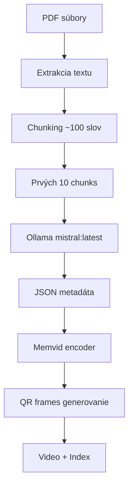

# PDF Library Processor s Memvid

Automatizovaný nástroj na spracovanie knižnice PDF súborov s použitím lokálnej Ollama AI na extrakciu metadát a vytvorenie video indexu pomocou memvid.

## 🎯 Účel

Skript spracováva kolekciu PDF kníh, extrahuje z nich metadáta (autori, vydavatelia, rok, DOI) pomocou lokálnej Ollama AI a vytvára vyhľadávateľný video index, kde každý chunk textu je zakódovaný do QR kódu vo video framoch.

## 📋 Požiadavky

### Systémové požiadavky
- Python >= 3.10
- Ollama server bežiaci na `localhost:11434`
- Modely v Ollama: `mistral:latest` a `nomic-embed-text`

### Python závislosti
```bash
pip install -r requirements.txt
```

```txt
memvid
PyPDF2
requests
tqdm
```

## 🏗️ Architektúra

### Komponenty

#### 1. **OllamaEmbedder**
- **Účel**: Generovanie embeddings pomocou `nomic-embed-text` modelu
- **Endpoint**: `POST http://localhost:11434/api/generate`
- **Parametre**: `{"model": "nomic-embed-text", "embedding": true}`

#### 2. **PDFLibraryProcessor** 
- **Hlavná trieda** zodpovedná za orchestráciu celého procesu
- **Konfigurácia**:
  - Vstupný priečinok: `./pdf_books`
  - Výstupný priečinok: `./memvid_out`
  - Chunk veľkosť: 512 znakov
  - Overlap: 50 znakov

### Workflow



## 🔧 Funkcionalita

### 1. Extrakcia metadát pomocou AI

```python
def extract_metadata_with_ollama(self, sample_text: str) -> Dict[str, str]:
```

**Proces**:
1. Vezme prvých 10 chunks z PDF
2. Spojí ich do sample_text 
3. Pošle prompt do `mistral:latest`:
   ```
   Extract JSON with keys: title, authors, publishers, year, doi from this text:
   [sample_text]
   Return only valid JSON.
   ```
4. Parsuje JSON odpoveď
5. Validuje a normalizuje dáta

**Výstup**:
```json
{
  "title": "RAG-Driven Generative AI",
  "authors": "Denis Rothman",
  "publishers": "Packt Publishing", 
  "year": "2024",
  "doi": "10.1234/example"
}
```

### 2. PDF Processing Pipeline

```python
def process_pdf(self, pdf_path: Path) -> bool:
```

**Kroky**:
1. **Extrakcia textu** pomocou PyPDF2
2. **Chunking** na ~100 slov per chunk
3. **Metadata extraction** z prvých 10 chunks
4. **Pridanie do memvid** encoder

### 3. Video Index Generation

```python
encoder.add_pdf(str(pdf_path), chunk_size=512, overlap=50)
encoder.build_video("library.mp4", "library_index.json")
```

**Vytvorí**:
- 🎥 **library.mp4**: Video kde každý frame obsahuje QR kód s chunks
- 📋 **library_index.json**: Metadata a mappings
- 🔍 **library_index.faiss**: Vector search index

## 📁 Štruktúra súborov

```
memvid/
├── pdf_library_processor.py    # Hlavný skript na spracovanie PDF
├── pdf_library_chat.py         # Chat interface pre video pamäť
├── requirements.txt            # Python závislosti  
├── pdf_books/                  # Vstupné PDF súbory
│   ├── book1.pdf
│   └── book2.pdf
├── memvid_out/                # Výstupné súbory
│   ├── library.mp4            # Video index
│   ├── library_index.json     # Metadata
│   └── library_index.faiss    # Vector index
└── venv/                      # Python virtualenv
```

## 🚀 Použitie

### 1. Príprava prostredia

```bash
# Vytvorenie virtual environment
python3 -m venv venv
source venv/bin/activate

# Inštalácia závislostí
pip install -r requirements.txt
```

### 2. Spustenie Ollama

```bash
# Stiahnutie modelov
ollama pull mistral:latest
ollama pull nomic-embed-text

# Overenie že Ollama beží
curl http://localhost:11434/api/tags
```

### 3. Pridanie PDF súborov

```bash
# Vytvorenie priečinka a pridanie PDF
mkdir -p pdf_books
cp *.pdf pdf_books/
```

### 4. Spustenie spracovania

```bash
python3 pdf_library_processor.py
```

### 5. Chat s knižnicou

Po vytvorení video indexu môžete spustiť chat interface:

```bash
python3 pdf_library_chat.py
```

## 📊 Výstup

### Konzola log
```
Found 7 PDF files to process
Processing: RAG-Driven Generative AI...
  - Pages: 517, Chunks: 1079
  - Extracting metadata...
  - Title: RAG-Driven Generative AI
  - Authors: Denis Rothman
  - Year: 2024
Processing: LangChain and LlamaIndex...
  - Pages: 86, Chunks: 194
  - Extracting metadata...
  - Title: LangChain and LlamaIndex Projects Lab Book
  - Authors: Mark Watson
  - Year: 2024

Building video index...
Generating QR frames: 100%|██████| 8975/8975
✅ SUCCESS!
📚 Processed 7 PDF books
🎥 Video saved to: memvid_out/library.mp4
📋 Index saved to: memvid_out/library_index.json
```

### Vytvorené súbory

#### `library.mp4`
- Video kde každý frame = 1 chunk ako QR kód
- Framerate: 1 FPS (default memvid)
- Formát: MP4 s H.264 codec

#### `library_index.json`
```json
{
  "chunks": [
    {
      "id": 0,
      "text": "Chapter 1: Introduction to RAG...",
      "frame": 0,
      "metadata": {
        "file_name": "rag_book.pdf",
        "title": "RAG-Driven Generative AI",
        "authors": "Denis Rothman",
        "year": "2024",
        "page": 15
      }
    }
  ],
  "total_frames": 8975,
  "total_chunks": 8975
}
```

#### `library_index.faiss`
- Binárny FAISS vector index
- 384-dimenzionálne embeddings (nomic-embed-text)
- Umožňuje semantické vyhľadávanie

## 🔍 Interné detaily

### Chunk Storage Lifecycle

1. **V pamäti**: `encoder.chunks[]` - list všetkých chunks
2. **Dočasne**: `/tmp/tmp*/frames/frame_*.png` - QR obrázky
3. **Finálne**: `library.mp4` + index súbory

### Error Handling

```python
# PDF parsing errors
except Exception as e:
    print(f"Error reading PDF {pdf_path}: {e}")
    return [], 0

# Ollama API errors  
except Exception as e:
    print(f"Error extracting metadata with Ollama: {e}")
    return self._empty_metadata()
```

### Performance

- **Chunk generovanie**: ~10 chunks/sec
- **QR frame generovanie**: ~10-15 frames/sec  
- **Metadata extrakcia**: ~5-10 sec per PDF
- **Celkový čas**: ~2-3 min pre 7 PDF (varies by size)

## 🎛️ Konfigurácia

### Memvid parametre
```python
# V PDFLibraryProcessor.__init__()
self.encoder = MemvidEncoder()

# V process_pdf()
self.encoder.add_pdf(str(pdf_path), chunk_size=512, overlap=50)
```

### Ollama endpointy
```python
# Embeddings
POST http://localhost:11434/api/generate
{
  "model": "nomic-embed-text",
  "prompt": text,
  "embedding": true
}

# Metadata extraction
POST http://localhost:11434/api/generate  
{
  "model": "mistral:latest",
  "prompt": "Extract JSON...",
  "options": {"temperature": 0.1}
}
```

## ⚠️ Známe limitácie

1. **PDF parsing**: Niektoré PDF môžu mať problémy s text extraction
2. **Ollama dostupnosť**: Vyžaduje bežiaci Ollama server
3. **Memory usage**: Veľké PDF môžu spotrebovať veľa RAM
4. **Processing time**: Video generovanie je časovo náročné
5. **Metadata quality**: Závisí od kvality text extraction a AI modelu

## 🔧 Troubleshooting

### Ollama connection failed
```bash
# Skontrolovať či Ollama beží
ollama list
curl http://localhost:11434/api/tags
```

### PDF extraction errors
```python
# Skontrolovať PyPDF2 log v konzole
# Niektoré PDF môžu byť chránené/poškodené
```

### Memory errors
```bash
# Spracovávať PDF po menších dávkach
# Alebo zvýšiť system memory/swap
```

## 📈 Rozšírenia

### Možné vylepšenia
1. **Batch processing**: Spracovanie po dávkach pre veľké kolekcie
2. **Multi-threading**: Paralelné spracovanie PDF
3. **Database storage**: Ukladanie do DB namiesto JSON
4. **Web interface**: GUI pre browsing a vyhľadávanie
5. **Alternative models**: Podpora pre iné LLM/embedding modely

### Custom metadata fields
```python
# Pridať nové pole do metadata extraction prompt
prompt = f"""Extract JSON with keys: title, authors, publishers, year, doi, isbn, language from this text:
{sample_text}
Return only valid JSON."""
```

# PDF Library Chat Interface

Interaktívny chat systém pre komunikáciu s PDF knižnicou pomocou video pamäte.

## 🎯 Funkcionalita

### Chat Commands
```
help          - Zobrazí nápovedu
info          - Informácie o knižnici  
search <query>- Vyhľadávanie v obsahu
stats         - Štatistiky session
clear         - Vyčistí obrazovku
exit/quit     - Ukončí chat
```

### Príklady používania

```bash
🤔 You: What is RAG in AI?
🤖 Assistant: Based on the library content, RAG (Retrieval Augmented Generation) is...

🤔 You: search machine learning
🔍 Search results for: 'machine learning' (0.15s)
📄 Relevant passages:
──────────────────────────────────────────────────
[Relevant text chunks from PDFs...]
──────────────────────────────────────────────────

🤔 You: info
📖 Library Overview:
   📚 Total books: 7
   📝 Total chunks: 8975

📑 Books in library:
   1. RAG-Driven Generative AI
      📖 Author(s): Denis Rothman
      📅 Year: 2024
      📝 Chunks: 1079
```

## 🔧 Technické detaily

### Komponenty
- **PDFLibraryChat**: Hlavná trieda pre chat interface
- **OllamaLLM**: Lokálne LLM pre generovanie odpovedí  
- **MemvidChat**: Video pamäť search a retrieval

### Workflow
1. **Načítanie video indexu** a validácia súborov
2. **Semantic search** v PDF chunks pomocou embeddings
3. **Context retrieval** z relevantných chunks
4. **LLM response** pomocou Ollama mistral:latest
5. **Formátovaný výstup** s metadátami

### Konfigurácia
```python
# V PDFLibraryChat.__init__()
self.chat = MemvidChat(video_file, index_file)
self.llm = OllamaLLM(model="mistral:latest")
```

---

**Autor**: Claude Code  
**Verzia**: 1.0  
**Posledná aktualizácia**: Jún 2025