# eLibrary - PDF Knowledge Base with RAG

Advanced PDF processing system that converts document libraries into searchable video-based indexes using Memvid technology and Retrieval Augmented Generation (RAG).

## Quick Start

### Prerequisites

- Python 3.8+
- Ollama with mistral:latest model
- Ollama with momic-embed-text embeding model
- MemVid library

### Installation

1. **Clone the repository**
```bash
git clone https://github.com/entira/elibrary.git
cd elibrary
```

2. **Install dependencies**
```bash
pip install -r requirements.txt
```

3. **Setup Ollama**
```bash
# Install Ollama from https://ollama.ai
ollama pull mistral:latest
ollama pull nomic-embed-text
```

4. **Add PDF files**
```bash
# Place your PDF files in the pdf_books directory
mkdir -p pdf_books
# Copy your PDF files here
```

### Basic Usage

1. **Process PDF library**
```bash
python3 pdf_library_processor.py
```

2. **Chat with your documents**
```bash
python3 pdf_chat.py
```

## Features

### Current Capabilities

- **Token-based Chunking**: Smart sliding window chunking (500 tokens, 15% overlap)
- **Enhanced Metadata**: Automatic extraction of titles, authors, publishers, publication years
- **PDF Page Citations**: Page references using PDF file page numbers in chat responses
- **Cross-page Context**: Context preservation across page boundaries
- **Smart Skip Processing**: Avoids reprocessing already processed PDFs
- **Parallel Processing**: Multi-worker QR generation for faster processing
- **Clean Output**: Comprehensive warning suppression for professional experience

### Architecture

```mermaid
graph LR
    subgraph "Input"
        PDF[📄 PDF Files]
    end
    
    subgraph "Processing"
        EXTRACT[🔧 Text Extraction]
        CHUNK[📝 Token Chunking]
        META[📊 Metadata Extraction]
        QR[📱 QR Generation]
        VIDEO[🎥 Video Assembly]
    end
    
    subgraph "Output"
        VID[🎥 library.mp4]
        INDEX[📋 library_index.json]
    end
    
    PDF --> EXTRACT
    EXTRACT --> CHUNK
    CHUNK --> META
    META --> QR
    QR --> VIDEO
    VIDEO --> VID
    VIDEO --> INDEX
```



### File Structure

```
elibrary/
├── pdf_books/                   # Input PDFs
├── pdf_library_processor.py     # Main processor
├── pdf_chat.py                  # Chat interface
├── requirements.txt             # Dependencies
├── memvid_out/                  # Output (excluded from git)
│   ├── library.mp4              # Video index
│   ├── library_index.json       # Enhanced metadata
│   └── library_index.faiss      # Vector index
└── README.md
```

## Usage Examples

### Processing Options

**Standard processing:**
```bash
python3 pdf_library_processor.py
```

**Force reprocess all files:**
```bash
python3 pdf_library_processor.py --force-reprocess
```

**Use multiple workers:**
```bash
python3 pdf_library_processor.py --max-workers 8
```

### Chat Interface

The chat system provides:
- Interactive Q&A with your PDF library
- Automatic citations with book titles and PDF page numbers
- Context-aware responses using RAG
- Real-time search across all processed documents

Example interaction:
```
> What are the best practices for podcasting?

Based on your library, here are key podcasting best practices:

1.	A predictable release schedule helps build listener habits. [The Podcast Blueprint, page 19]

2.	Clear, high-fidelity audio is essential for professional podcast presentation. [Audio Mastery for Podcasters, page 42]

3.	Successful episodes mix storytelling with actionable insights. [Smart Podcast Strategies, page 58]
```

## Configuration

### Environment Setup

The system automatically detects and uses:
- Local Ollama installation at `http://localhost:11434`
- PDF files in `./pdf_books/` directory
- Output directory at `./memvid_out/`

### Dependencies

Core dependencies (see `requirements.txt`):
- `memvid` - Video indexing library
- `pymupdf` - PDF text extraction
- `tiktoken` - Token-based chunking
- `requests` - HTTP communication
- `tqdm` - Progress tracking

## Technical Details

### Processing Pipeline

1. **PDF Text Extraction**: Uses PyMuPDF for high-quality text extraction with page tracking
2. **Text Cleaning**: Removes encoding artifacts and formatting issues
3. **Token-based Chunking**: Creates 500-token chunks with 15% overlap and PDF page references
4. **Metadata Extraction**: Uses LLM to extract structured metadata
5. **QR Code Generation**: Parallel generation of video frames
6. **Index Building**: Creates searchable vector index with page citations

### Chunking Strategy

- **Chunk Size**: 500 tokens (~2000 characters)
- **Overlap**: 15% (75 tokens) for context continuity
- **Boundary Detection**: Smart sentence boundary preservation
- **Cross-page Chunks**: Additional chunks spanning page boundaries

### Performance Optimizations

- **Smart Skip**: Avoids reprocessing existing files
- **Parallel QR Generation**: Multi-worker processing
- **Warning Suppression**: Clean output without library warnings
- **Progress Tracking**: Real-time processing feedback

## Troubleshooting

### Common Issues

**Ollama Connection**
```bash
# Check if Ollama is running
curl http://localhost:11434/api/tags

# Start Ollama if needed
ollama serve
```

**Missing Models**
```bash
# Pull required models
ollama pull mistral:latest
ollama pull nomic-embed-text
```

**Memory Issues**
```bash
# Reduce workers for low-memory systems
python3 pdf_library_processor.py --max-workers 2
```

## Future Roadmap

### Planned Features

- **CDN/S3 Streaming**: On-demand video frame streaming from cloud storage
- **Content Encryption**: AES-256-GCM encryption for QR code content
- **MCP Server**: Model Context Protocol implementation for AI assistant integration
- **Advanced Search**: Semantic search with similarity scoring
- **Multi-format Support**: EPUB, ...

### Architecture Evolution

Future versions will support:
- Distributed processing across multiple nodes
- Real-time collaborative editing
- Integration with external knowledge bases
- Advanced analytics and usage metrics
- Mobile application support

---

## Contributing

1. Fork the repository
2. Create a feature branch
3. Make your changes
4. Test thoroughly
5. Submit a pull request

## License

This project is licensed under the **GNU Affero General Public License v3.0 (AGPL-3.0)**.

### Why AGPL-3.0?

This license was chosen due to the inclusion of PyMuPDF, which requires AGPL-3.0 licensing. The AGPL-3.0 ensures:

- ✅ **Open Source**: Source code must remain available
- ✅ **Network Copyleft**: Modifications to network services must be shared
- ✅ **Community Protection**: Prevents proprietary forks
- ✅ **Commercial SaaS**: Can be used in commercial SaaS with source disclosure

### What This Means

- **✅ Personal Use**: Free to use for personal projects
- **✅ Research & Education**: Perfect for academic and research use
- **✅ Open Source Projects**: Can be included in other AGPL/GPL projects
- **✅ Commercial SaaS**: Can be used commercially if source is provided
- **❌ Proprietary Software**: Cannot be included in closed-source products

### Dependencies

All dependencies are compatible with AGPL-3.0:
- memvid (MIT), requests (Apache 2.0), tiktoken (MIT), qrcode (MIT), opencv-python (Apache 2.0), tqdm (MIT/MPL-2.0)
- PyMuPDF (AGPL-3.0) - requires this project to be AGPL-3.0

See [LICENSE_ANALYSIS.md](LICENSE_ANALYSIS.md) for detailed licensing information and [NOTICE](NOTICE) for third-party attributions.
