# eLibrary - PDF Knowledge Base with RAG

Advanced PDF processing system that converts document libraries into searchable video-based indexes using Memvid technology and Retrieval Augmented Generation (RAG).

## Quick Start

### Prerequisites

- Python 3.8+
- Ollama with mistral:latest model
- Ollama with momic-embed-text embeding model
- MemVid library

### Installation

1. **Clone the repository**
```bash
git clone https://github.com/entira/elibrary.git
cd elibrary
```

2. **Install dependencies**
```bash
pip install -r requirements.txt
```

3. **Setup Ollama**
```bash
# Install Ollama from https://ollama.ai
ollama pull gemma3:4b-it-qat   # For chat responses and metadata
ollama pull nomic-embed-text   # For embeddings
```

4. **Add PDF files**
```bash
# Create library structure (supports multiple libraries)
mkdir -p library/1/pdf library/2/pdf
# Copy your PDF files to the appropriate library directories
cp your_pdfs_set1/* library/1/pdf/
cp your_pdfs_set2/* library/2/pdf/
```

### Basic Usage

#### New Modular Processor (Recommended)
```bash
# Modern modular processor with enhanced CLI
python3 pdf_processor.py

# See all options and examples
python3 pdf_processor.py --help

# Show detailed configuration guide
python3 pdf_processor.py --help-config

# Test all modules before processing
python3 pdf_processor.py --test-modules

# High-performance processing with parallel workers
python3 pdf_processor.py --max-workers 8 --quiet

# Force reprocess with custom chunking
python3 pdf_processor.py --force-reprocess --chunk-size 750 --overlap 0.25
```

#### Legacy Processor (Still Available)
```bash
# Original monolithic processor
python3 pdf_library_processor.py
```

#### Chat Interface
```bash
# Basic chat with default settings
python3 pdf_chat.py

# Customize Ollama model and server
python3 pdf_chat.py --model mistral:latest --base-url http://localhost:11435

# Use environment variables for configuration
OLLAMA_MODEL=gemma3:4b-it-qat OLLAMA_BASE_URL=http://localhost:11434 python3 pdf_chat.py

# See all chat options
python3 pdf_chat.py --help
```

## Features

### Current Capabilities

- **Modular Architecture**: Six specialized modules for maintainable, testable processing
- **Multi-Library Support**: Automatic discovery and processing of multiple PDF library instances (library/1/, library/2/, etc.)
- **Cross-Library Search**: Search across all libraries simultaneously with library-aware citations
- **Token-based Chunking**: Smart sliding window chunking (500 tokens, 15% overlap) with tiktoken
- **Enhanced Metadata**: AI-powered extraction using optimized LLM model (gemma3:4b-it-qat)
- **PDF Page Citations**: Accurate page references with library context [Book Title, page X - Library Y]
- **Cross-page Context**: Context preservation across page boundaries
- **Semantic Search**: Vector-based search across all processed content using nomic-embed-text
- **Smart Skip Processing**: Per-library skip mechanism for efficient processing
- **Parallel QR Generation**: Multi-worker ProcessPoolExecutor with comprehensive warning suppression
- **Clean Output**: Enhanced multi-layered warning suppression with stdout/stderr redirection
- **Module Testing**: Comprehensive test suite for all components with `--test-modules`
- **Advanced Configuration**: JSON config support, CLI overrides, and detailed help system
- **Customizable Chat Interface**: CLI arguments and environment variables for Ollama model/server configuration
- **Enhanced Search Results**: Score-based ranking and improved multi-library result aggregation
- **Metadata Caching**: Optimized citation lookup with refresh capabilities

### Architecture

#### Modular Processing Pipeline

```mermaid
graph TD
    A[📄 PDF Files] --> B[🔧 TextExtractor]
    B --> C[📊 MetadataExtractor]
    B --> D[📝 TextChunker]
    C --> D
    D --> E[🧠 EmbeddingService]
    D --> F[📱 QRGenerator]
    F --> G[🎥 VideoAssembler]
    E --> H[🔍 Vector Database]
    G --> I[🎥 library.mp4 + 📋 library_index.json]
    
    style A fill:#e1f5fe
    style I fill:#e8f5e8
    style B fill:#fff3e0
    style C fill:#fce4ec
    style D fill:#f3e5f5
    style E fill:#e0f2f1
    style F fill:#fff8e1
    style G fill:#e3f2fd
```



#### Module Responsibilities
- **TextExtractor**: PyMuPDF-based PDF text extraction with page mapping
- **MetadataExtractor**: AI-powered title/author/publisher extraction
- **TextChunker**: Token-based sliding window chunking with overlap
- **EmbeddingService**: Vector embeddings using nomic-embed-text
- **QRGenerator**: Parallel QR frame generation with ProcessPoolExecutor
- **VideoAssembler**: MemVid integration for final video creation

### Project Structure

```
elibrary/
├── pdf_processor.py        # Modern modular processor (RECOMMENDED)
├── pdf_library_processor.py # Legacy monolithic processor
├── pdf_chat.py             # Multi-library chat interface
├── modules/                # Modular architecture
│   ├── __init__.py
│   ├── text_extractor.py   # PyMuPDF text extraction
│   ├── metadata_extractor.py # AI metadata extraction
│   ├── text_chunker.py     # Token-based chunking
│   ├── embedding_service.py # Vector embeddings
│   ├── qr_generator.py     # Parallel QR generation
│   └── video_assembler.py  # MemVid integration
├── docs/                   # Detailed module documentation
│   └── modules/            # Per-module technical docs
├── library/                # Multi-library structure
│   ├── 1/                  # Library instance 1
│   │   ├── pdf/            # Input PDFs for Library 1
│   │   └── data/           # Generated files for Library 1
│   │       ├── library.mp4
│   │       ├── library_index.json
│   │       └── library_index.faiss
│   ├── 2/                  # Library instance 2
│   │   ├── pdf/            # Input PDFs for Library 2
│   │   └── data/           # Generated files for Library 2
│   └── ...                 # Additional libraries (3, 4, etc.)
├── CLAUDE.md              # Developer documentation
└── requirements.txt        # Dependencies
```

## Usage Examples

### Processing Options

#### Modular Processor (Recommended)
```bash
# Test all modules first (recommended)
python3 pdf_processor.py --test-modules

# Standard processing with defaults
python3 pdf_processor.py

# Force reprocess all files
python3 pdf_processor.py --force-reprocess

# High performance processing with parallel workers
python3 pdf_processor.py --max-workers 12 --fps 60 --quality high

# Fast processing (skip embeddings) with clean output
python3 pdf_processor.py --no-embeddings --quiet --max-workers 4

# Custom chunking for large documents
python3 pdf_processor.py --chunk-size 750 --overlap 0.25

# Use custom configuration file
python3 pdf_processor.py --config my_config.json

# Debug mode with detailed output
python3 pdf_processor.py --max-workers 8 --chunk-size 500 --overlap 0.15
```

#### Legacy Processor
```bash
# Original processor (still available)
python3 pdf_library_processor.py
python3 pdf_library_processor.py --force-reprocess
python3 pdf_library_processor.py --max-workers 8
```

### Multi-Library Chat Interface

The enhanced chat system provides:
- Interactive Q&A across all your PDF libraries
- **Customizable Ollama Configuration**: CLI arguments and environment variables
- Automatic citations with library context [Book Title, page X - Library Y]
- Cross-library search with unified results and score-based ranking
- Context-aware responses using RAG
- Semantic search across all processed documents with vector embeddings
- Real-time search results with relevance-based ranking across libraries
- **Metadata Caching**: Fast citation lookup with refresh capabilities
- **Enhanced Commands**: `help`, `info`, `stats`, `clear`, `search`, `refresh`

Example interaction:
```
> What are the best practices for podcasting?

Based on your library, here are key podcasting best practices:

1.	A predictable release schedule helps build listener habits. [The Podcast Blueprint, page 19]

2.	Clear, high-fidelity audio is essential for professional podcast presentation. [Audio Mastery for Podcasters, page 42]

3.	Successful episodes mix storytelling with actionable insights. [Smart Podcast Strategies, page 58]
```

## Configuration

### Environment Setup

The system automatically detects and uses:
- Local Ollama installation at `http://localhost:11434`
- PDF files in `./library/1/pdf/` directory  
- Output directory at `./library/1/data/`

### Chat Configuration

The chat interface supports multiple configuration methods:

**Environment Variables:**
```bash
export OLLAMA_MODEL=mistral:latest        # Default model for chat
export OLLAMA_BASE_URL=http://localhost:11435  # Custom Ollama server
```

**CLI Arguments:**
```bash
python3 pdf_chat.py --model gemma3:4b-it-qat --base-url http://localhost:11434
```

**Priority Order:** CLI arguments → Environment variables → Defaults

### Dependencies

See `requirements.txt` for complete list. Key dependencies:
- `memvid` - Video indexing
- `pymupdf` - PDF processing  
- `tiktoken` - Text chunking
- `requests` - Ollama communication

## Technical Overview

For detailed technical documentation, see [CLAUDE.md](CLAUDE.md).

### Key Technologies

- **PyMuPDF**: High-quality PDF text extraction with page mapping
- **Ollama**: Local LLM ecosystem
  - `gemma3:4b-it-qat`: Optimized for metadata extraction and chat responses
  - `nomic-embed-text`: High-quality vector embeddings (768 dimensions)
- **MemVid**: Video-based indexing and QR code generation with monkey patching
- **tiktoken**: GPT-4 compatible tokenization for precise chunking
- **ProcessPoolExecutor**: Parallel QR generation with comprehensive warning suppression
- **FAISS**: Vector similarity search
- **Token-based Processing**: Optimal 500-token chunks with 15% overlap for RAG

## Troubleshooting

### Common Issues

**Ollama Connection**
```bash
# Check if Ollama is running
curl http://localhost:11434/api/tags

# Start Ollama if needed
ollama serve
```

**Missing Models**
```bash
# Pull required models
ollama pull gemma3:4b-it-qat   # For chat responses and metadata
ollama pull nomic-embed-text   # For embeddings
```

**Memory Issues**
```bash
# Reduce workers for low-memory systems
python3 pdf_processor.py --max-workers 2

# Test modules individually
python3 pdf_processor.py --test-modules

# Legacy processor with fewer workers
python3 pdf_library_processor.py --max-workers 2
```

## Future Roadmap

### Planned Features

- **Enhanced Modules**: Additional specialized processors for different document types
- **CDN/S3 Streaming**: On-demand video frame streaming from cloud storage
- **Content Encryption**: AES-256-GCM encryption for QR code content
- **MCP Server**: Model Context Protocol implementation for AI assistant integration
- **Advanced Search**: Enhanced semantic search with similarity scoring
- **Multi-format Support**: EPUB, DOCX, and other document formats
- **Configuration UI**: Web-based configuration management for modules
- **Performance Metrics**: Real-time monitoring and optimization suggestions

### Architecture Evolution

Future versions will support:
- Distributed processing across multiple nodes
- Real-time collaborative editing
- Integration with external knowledge bases
- Advanced analytics and usage metrics
- Mobile application support

---

## Contributing

1. Fork the repository
2. Create a feature branch
3. Make your changes
4. Test thoroughly
5. Submit a pull request

## License

This project is licensed under the **GNU Affero General Public License v3.0 (AGPL-3.0)**.

### Why AGPL-3.0?

This license was chosen due to the inclusion of PyMuPDF, which requires AGPL-3.0 licensing. The AGPL-3.0 ensures:

- ✅ **Open Source**: Source code must remain available
- ✅ **Network Copyleft**: Modifications to network services must be shared
- ✅ **Community Protection**: Prevents proprietary forks
- ✅ **Commercial SaaS**: Can be used in commercial SaaS with source disclosure

### What This Means

- **✅ Personal Use**: Free to use for personal projects
- **✅ Research & Education**: Perfect for academic and research use
- **✅ Open Source Projects**: Can be included in other AGPL/GPL projects
- **✅ Commercial SaaS**: Can be used commercially if source is provided
- **❌ Proprietary Software**: Cannot be included in closed-source products

### Dependencies

All dependencies are compatible with AGPL-3.0:
- memvid (MIT), requests (Apache 2.0), tiktoken (MIT), qrcode (MIT), opencv-python (Apache 2.0), tqdm (MIT/MPL-2.0)
- PyMuPDF (AGPL-3.0) - requires this project to be AGPL-3.0

See [LICENSE_ANALYSIS.md](LICENSE_ANALYSIS.md) for detailed licensing information and [NOTICE](NOTICE) for third-party attributions.
