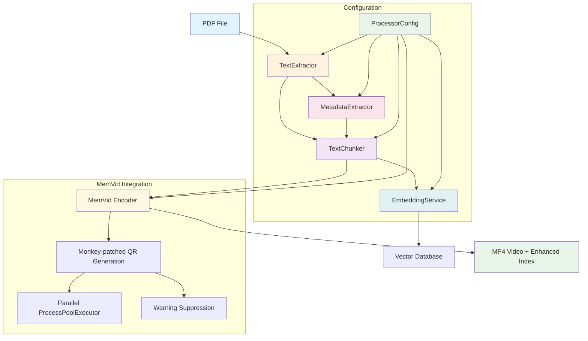

# Module Architecture Overview

## System Architecture

The PDF processing system has been modularized into six specialized components, each handling a specific aspect of the PDF-to-video pipeline. This architecture promotes maintainability, testability, and scalability.

**Recent Enhancements:**
- Enhanced chat interface with customizable Ollama configuration
- Score-based result ranking across multi-library searches
- Metadata caching for improved citation performance
- CLI arguments and environment variable support

## Module Hierarchy



## Module Dependencies

### Core Dependencies
- **TextExtractor**: PyMuPDF (standalone)
- **MetadataExtractor**: Ollama API (gemma3:4b-it-qat)
- **TextChunker**: tiktoken (standalone)
- **EmbeddingService**: Ollama API (nomic-embed-text)
- **MemVid Encoder**: MemVid with monkey-patching, ProcessPoolExecutor
- **ProcessorConfig**: Centralized configuration management

### Inter-Module Dependencies
```
ProcessorConfig → All Modules (configuration)
TextExtractor → TextChunker
TextExtractor → MetadataExtractor
MetadataExtractor → TextChunker (metadata enhancement)
TextChunker → EmbeddingService
TextChunker → MemVid Encoder
MemVid Encoder → Enhanced Index Output
```

## ProcessorConfig Architecture

The system uses a centralized configuration class that manages all module settings:

```python
@dataclass
class ProcessorConfig:
    # Core processing
    max_workers: int = 4
    force_reprocess: bool = False
    quiet: bool = False
    
    # Chunking configuration
    chunk_size: int = 500
    overlap_percentage: float = 0.15
    
    # Model configuration
    ollama_base_url: str = "http://localhost:11434"
    metadata_model: str = "gemma3:4b-it-qat"
    embedding_model: str = "nomic-embed-text"
    
    # Video generation
    video_fps: int = 30
    video_quality: str = "medium"
    
    # Advanced options
    skip_embeddings: bool = False
    test_modules: bool = False
```

## Warning Suppression System

Comprehensive multi-layered warning suppression:

```python
# Environment level
os.environ['TF_CPP_MIN_LOG_LEVEL'] = '3'
os.environ['TOKENIZERS_PARALLELISM'] = 'false'

# Import level with stdout/stderr redirection
with warnings.catch_warnings(), \
     contextlib.redirect_stdout(StringIO()), \
     contextlib.redirect_stderr(StringIO()):
    warnings.simplefilter("ignore")
    from memvid import MemvidEncoder

# Worker process level
def generate_single_qr_global(args):
    with contextlib.redirect_stderr(open(os.devnull, 'w')):
        # QR generation with all warnings suppressed
        return process_qr(args)
```

## Data Flow

### 1. Text Extraction Phase
```python
# Input: PDF file
# Output: Page texts, page count, page offset
page_texts, num_pages, offset = text_extractor.extract_text_with_pages(pdf_path)
first_page = text_extractor.extract_first_page_text(pdf_path)
```

### 2. Metadata Extraction Phase
```python
# Input: First page text, filename
# Output: Structured metadata
metadata = metadata_extractor.extract_metadata(first_page, filename)
```

### 3. Text Chunking Phase
```python
# Input: Page texts, page offset
# Output: Enhanced chunks with metadata
chunks = text_chunker.create_enhanced_chunks(page_texts, offset)

# Enhance with extracted metadata
for chunk in chunks:
    chunk.enhanced_metadata.update(metadata)
```

### 4. Embedding Generation Phase
```python
# Input: Chunk texts
# Output: Vector embeddings
texts = [chunk.text for chunk in chunks]
embeddings = embedding_service.embed(texts)
```

### 5. QR Generation Phase
```python
# Input: Chunks with metadata
# Output: QR frame images
chunk_data = [{"text": c.text, "metadata": c.enhanced_metadata} for c in chunks]
frames_dir, stats = qr_generator.generate_qr_frames(chunk_data, temp_dir)
```

### 6. Video Assembly Phase
```python
# Input: QR frames, chunks, metadata
# Output: MP4 video + JSON index
result = video_assembler.assemble_video(frames_dir, chunk_data, video_path, index_path)
```

## Module Interfaces

### Standard Input/Output Patterns

Each module follows consistent interface patterns:

**Input Validation:**
- Type checking with Python typing
- Error handling for invalid inputs
- Graceful degradation for edge cases

**Output Standardization:**
- Consistent return types
- Comprehensive metadata
- Statistics and performance metrics

**Error Handling:**
- Descriptive error messages
- Fallback mechanisms
- Logging and debugging support

## Configuration Management

### Module-Specific Configuration

Each module accepts configuration parameters:

```python
# TextChunker configuration
chunker = TextChunker(
    chunk_size=500,
    overlap_percentage=0.15,
    cross_page_context=100
)

# MetadataExtractor configuration  
extractor = MetadataExtractor(
    model="gemma3:4b-it-qat",
    max_retries=2
)

# QRGenerator configuration
generator = QRGenerator(
    n_workers=8,
    show_progress=True
)
```

### Global Configuration (Future)

A centralized configuration system could be implemented:

```python
# config.py
class Config:
    # Text processing
    CHUNK_SIZE = 500
    OVERLAP_PERCENTAGE = 0.15
    
    # LLM settings
    METADATA_MODEL = "gemma3:4b-it-qat"
    EMBEDDING_MODEL = "nomic-embed-text"
    OLLAMA_BASE_URL = "http://localhost:11434"
    
    # Processing
    MAX_WORKERS = 8
    VIDEO_FPS = 30
    VIDEO_QUALITY = "medium"
```

## Testing Strategy

### Unit Testing

Each module includes standalone testing:

```bash
# Test individual modules
python modules/text_extractor.py test_document.pdf
python modules/metadata_extractor.py test_document.txt
python modules/embedding_service.py health
```

### Integration Testing

Test module interactions:

```python
# Test text extraction → chunking
extractor = TextExtractor()
chunker = TextChunker()
page_texts, _, offset = extractor.extract_text_with_pages(pdf_path)
chunks = chunker.create_enhanced_chunks(page_texts, offset)
assert len(chunks) > 0
```

### End-to-End Testing

Test complete pipeline:

```python
# Full pipeline test
def test_complete_pipeline(pdf_path):
    # Extract text
    extractor = TextExtractor()
    page_texts, num_pages, offset = extractor.extract_text_with_pages(pdf_path)
    
    # Extract metadata
    metadata_extractor = MetadataExtractor()
    first_page = extractor.extract_first_page_text(pdf_path)
    metadata = metadata_extractor.extract_metadata(first_page, pdf_path.name)
    
    # Create chunks
    chunker = TextChunker()
    chunks = chunker.create_enhanced_chunks(page_texts, offset)
    
    # Enhance with metadata
    for chunk in chunks:
        chunk.enhanced_metadata.update(metadata)
    
    # Generate embeddings
    embedding_service = EmbeddingService()
    texts = [chunk.text for chunk in chunks]
    embeddings = embedding_service.embed(texts)
    
    # Generate QR frames
    generator = QRGenerator()
    chunk_data = [{"text": c.text, "metadata": c.enhanced_metadata} for c in chunks]
    frames_dir, qr_stats = generator.generate_qr_frames(chunk_data, temp_dir)
    
    # Assemble video
    assembler = VideoAssembler()
    result = assembler.assemble_video(frames_dir, chunk_data, video_path, index_path)
    
    return result["success"]
```

## Performance Characteristics

### Module Performance Profiles

| Module | CPU Usage | Memory Usage | I/O Pattern | Scalability |
|--------|-----------|--------------|-------------|-------------|
| TextExtractor | Low | Low | File I/O | Linear |
| MetadataExtractor | Medium | Low | Network I/O | Linear |
| TextChunker | Low | Medium | Memory | Linear |
| EmbeddingService | Medium | Low | Network I/O | Batch |
| QRGenerator | High | Medium | File I/O | Parallel |
| VideoAssembler | High | High | File I/O | Linear |

### Bottleneck Analysis

**Processing Bottlenecks:**
1. **QR Generation**: CPU-intensive, benefits from parallelization
2. **Video Assembly**: Memory-intensive, MemVid processing
3. **LLM Calls**: Network latency, API rate limits

**Optimization Strategies:**
1. **Parallel QR Generation**: Multiple worker processes
2. **Batch Embedding**: Process multiple texts together
3. **Caching**: Cache metadata and embeddings
4. **Streaming**: Process large documents in chunks

## Error Handling Philosophy

### Graceful Degradation

Each module implements graceful degradation:

- **TextExtractor**: Skip problematic pages, continue processing
- **MetadataExtractor**: Fall back to filename parsing
- **TextChunker**: Handle edge cases with minimum chunk sizes
- **EmbeddingService**: Provide zero vectors for failed embeddings
- **QRGenerator**: Continue with partial frame generation
- **VideoAssembler**: Detailed error reporting with context

### Error Propagation

```python
# Errors are captured and reported, not silently ignored
try:
    result = module.process(input_data)
    if not result.success:
        logger.warning(f"Module processing completed with warnings: {result.warnings}")
except Exception as e:
    logger.error(f"Module processing failed: {e}")
    # Implement fallback or raise with context
```

## Future Enhancements

### Modular Extensibility

The architecture supports easy extension:

**Alternative Implementations:**
- Different text extractors (OCR-based, cloud APIs)
- Alternative chunking strategies (semantic, paragraph-based)
- Multiple embedding models (OpenAI, HuggingFace)
- Different QR generators (faster libraries, different formats)

**Plugin Architecture:**
```python
# Future plugin system
from modules.base import TextExtractorBase

class OCRTextExtractor(TextExtractorBase):
    def extract_text_with_pages(self, pdf_path):
        # OCR-based implementation
        pass

# Register plugin
register_text_extractor("ocr", OCRTextExtractor)
```

### Distributed Processing

Modules can be enhanced for distributed processing:

- **Microservices**: Deploy modules as independent services
- **Message Queues**: Async processing with RabbitMQ/Redis
- **Containerization**: Docker containers for each module
- **Orchestration**: Kubernetes for scaling and management

### Monitoring and Observability

- **Metrics Collection**: Performance metrics for each module
- **Health Checks**: Service availability monitoring
- **Distributed Tracing**: Track requests across modules
- **Alerting**: Automated alerts for failures or performance issues

## Best Practices

### Module Development

1. **Single Responsibility**: Each module has one clear purpose
2. **Interface Consistency**: Standard input/output patterns
3. **Error Handling**: Comprehensive error handling and logging
4. **Documentation**: Detailed API documentation and examples
5. **Testing**: Unit tests and integration tests
6. **Performance**: Monitor and optimize bottlenecks

### Integration Guidelines

1. **Loose Coupling**: Modules communicate through well-defined interfaces
2. **Data Validation**: Validate data at module boundaries
3. **Configuration**: Externalize configuration parameters
4. **Logging**: Consistent logging across all modules
5. **Monitoring**: Track performance and errors
6. **Versioning**: Maintain backward compatibility